# biomaestudio.com

```mermaid
architecture-beta
    group client(cloud)[Cliente]
    group cdn(cloud)[Cloudflare CDN]
    group vercel(cloud)[Vercel]
    group origin(cloud)[Origen]

    service user(mdi:user)[User] in client
    service browser(server)[Navegador] in client
    service browserCache(disk)[Cache] in client
    service cfCache(disk)[Cache] in cdn

    service vercelCache(disk)[Cache] in vercel
    service vercelFn(server)[Vercel Function] in vercel

    service cloudinary(cloud)[Cloudinary] in origin

    user:R --> L:browser
    browser:B <--> T:browserCache

    browser:R --> L:cfCache
    cfCache:R --> L:vercelCache
    vercelCache:R --> L:vercelFn
    vercelFn:R --> L:cloudinary

    cloudinary:L --> R:vercelFn
    vercelFn:L --> R:vercelCache
    vercelCache:L --> R:cfCache
    cfCache:L --> R:browser
```

| Command                   | Action                                           |
| :------------------------ | :----------------------------------------------- |
| `npm install`             | Installs dependencies                            |
| `npm run dev`             | Starts local dev server at `localhost:4321`      |
| `npm run build`           | Build your production site to `./dist/`          |
| `npm run preview`         | Preview your build locally, before deploying     |
| `npm run astro ...`       | Run CLI commands like `astro add`, `astro check` |
| `npm run astro -- --help` | Get help using the Astro CLI                     |
